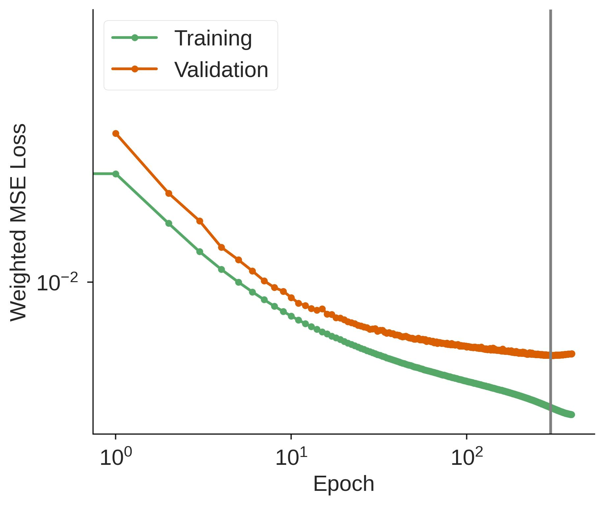

# Latitude-Longitude Latent Mesh

## Training and Inference


### 300 epochs
```
anemoi-datasets==0.5.26
anemoi-core ... commit=5dd32ca1 + feature/aml
* training-0.5.1+
* models-0.8.1+
* graphs-0.6.2+
anemoi-inference = d9efac5 ... 0.6.3+
anemoi-utils ... fdf0fc8 ... 0.4.28+
anemoi-transform==0.1.13
```

### 30k steps


(and debug.yaml) This one is with:

```
anemoi-datasets 410d1e
anemoi-core feature/azure-mlflow (rebased on top of 8e97af)
anemoi-inference 0.7.1
anemoi-utils 732182
anemoi-transforms 32cb93
```


```
srun --jobid $SLURM_JOB_ID ~/anemoi-house/slurm2ddp.sh anemoi-training train --config-name=config
```

## TODO

- [ ] Train model with "default" scalings, `num_channels=512`, merged dataset
    * will get converged model at 300 epochs
    * show speed from merged dataset
- [ ] Same, `num_channels=1024`
    * Is this any better at 1 degree?
- [ ] Test loss scaling schemes


## Loss Scaling


## Model Size

How does 1 degree skill change with number of channels?

With `num_channels = 1024`


```
  | Name    | Type                 | Params | Mode
---------------------------------------------------------
0 | model   | AnemoiModelInterface | 232 M  | train
1 | loss    | MSELoss              | 0      | train
2 | metrics | ModuleDict           | 0      | train
---------------------------------------------------------
232 M     Trainable params
0         Non-trainable params
232 M     Total params
928.088   Total estimated model params size (MB)
278       Modules in train mode
0         Modules in eval mode
```


## Max steps vs epochs

Note that I initially was training to 300k iterations, but this cycles through
the dataset more than we need.
Looking at the validation loss, it starts to tail off at 300 epochs, and even
starts to increase a bit afterward.
So, 300 epochs seems like a reasonable stopping point




## Speed Tests

Things ran way slower than expected, so first, reduced the size of the latent
mesh (graph edges), and sorted the nodes and edges.

Then tested the following parameters:
* Specify CPUs in SLURM job via `cpus-per-task`:
    * not specifying this (i.e., removing this line from the slurm job)
      had the biggest benefit of any of these tests, speedup of 20%
* `prefetch_factor`
    * 2 vs 4, 2 is faster by about 1.5 min
* `num_workers`: (training, validation, testing):
    * (8, 8, 1) about ~50sec faster than (8, 4, 4)
    * (4, 4, 1) ... a little bit worse but probably insignificant (40 sec)
* `limit_batches` setting test to 1, unclear impact, but may as well.
* Larger batch size:
    * My default (1, 1, 1) about 1min faster than (2, 4, 1)
* Turn off system diagnostics
    * Made no difference, and looks like eyeball stdev is about 1min here


Other things to try:
* Combine the anemoi datasets...


